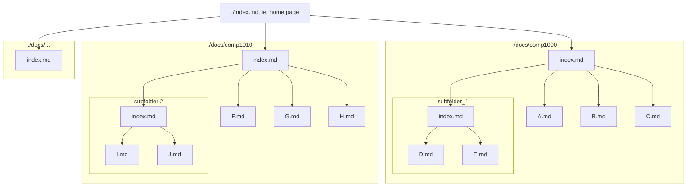

Live [here](https://ccheung96.github.io/software-tech-demo/)

The theme used is [Just the Docs](https://just-the-docs.com/) (JTD).

This project is intended to make it easy for 

If adding content is your only focus, all you need to do is write the content using Markdown, Mermaid, and JTD features. Occasiaonally you might need to add HTML or some pre-made HTML structures

## Just the Docs
JTD provides a number of layouts, but aside from the Home Page, all the pages in this project are a customised version of the JTD page layout which was configured in _layouts/custom-page.html. 

### Front Matter
The content at the beginning of the page, separated from the actual content by `---`, configures the page and its layout
* `title`: The page name that will appear on the sidebar. This will also be the appear as the title in page, unless specified by `custom-title`. **This is mandatory.**
* `custom-title`: A title that you want to use for the page itself. Unless specified, it defaults to the value set by `title`.
* `permalink`: By default, the link is based on the file's path, but since we don't want '/docs/' to appear as part of the link, each link has to be hard-coded (sorry).
* `parent`: If the page is a child of another page, specify the `title` of that parent page.
* `nav_order`: This determines the order of a page as it will apear on the sidebar in relation to its "siblings", ie. pages with the same parent. Start from 1.
* `grandparent`: If the page is a grandchild of another page, specify the `title` of that grandparent page. 
* `has_children`: If the page is expected to have one or more child pages, this is how it is declared. The children are not specified, however. 
* `has_toc`: Defines whether the page has a Table of Contents (TOC). By default this is set to true. For some pages, however, the placement of the TOC still needs to be hard-coded.
* `layout`: The default layout has been set to `custom-page`, which is defined in and inherits from Just the Doc's `page` layout. `_config.yml`. Currently, `custom-page` includes a title and author at the top of a page, before the rest of the page content. The Table of Contents (TOC) cannot be included here, since its ability to generate is dependent on the page contents. 

## Page Hierarchy and Navigation




## Snippets

In VS code, snippets are customised autocomplete templates help to reduce the time spent writing repetitive code. [Here were some that have come in handy so far.](#appendix-snippets)

### Configuration

 Snippets can be made to be used globally, or only for a specific project. To make a snippet, first create a new snippet JSON file (Ctrl-P -> Snippets: Configure snippets -> New Snippets file for [project_name] / New Global Snippets file).

In the snippet file, define each snippet with: 
* a name (outside the snippet), 
* a prefix, which will be used to autocomplete, and 
* a body, which is the template code for the snippet itself.
* a desciption, describing the snippet, is optional.

Afterwards, save the file and reload the window to enable the changes. Snippet files can be modified at any time. (Ctrl-P -> Snippets: Configure snippets -> [snippet_file].code_snippets).

### Usage
In the page, type in the snippet's prefix, example `html-img`, and then press `tab` to autocomplete.

More information is avaliable [here](https://code.visualstudio.com/docs/editing/userdefinedsnippets).

## Appendix: Snippets

These are [snippets](#snippets) that have been used in creating the project so far.

### HTML Snippets

```
	"HTML Image Tag": {
		"prefix": "html-img",
		"body": "",
		"description": "Insert HTML image tag"
	},

	"Site BaseURL":{
		"prefix": "baseurl",
		"body": "{{ site.baseurl }}",
		"description": "Insert Base URL"
	},

	"Youtube Embed": {
		"prefix": "youtube",
		"body": "",
		"description": "template for using youtube.html to add youtube videos"
	},

	"Exercise-Solution Blocks": {
		"prefix": "exercise",
		"body": "<!-- ${title:Exercise} -->\n\n${1:problem}\n\n\n\n${2:solution}\n\n\n",
		"description": "An exercise and solution block capture and include block template. Only one solution by default."
	},

	"Prerequisite-Outcome Blocks": {
		"prefix": "prereqs",
		"body": "<!-- Assumed Knowledge -->\n\n$1\n\n<!-- Learning Outcomes -->\n\n$2\n\n\n",
		"description": "Capture-and-Include block for Assumed Knowledge and Learning Outcomes"
	},

	"D3js Grid HTML": {
		"prefix": "d3js-grid",
		"body": "<div class=\"grid\" id=\"$1\" rows=9 cols=9></div>",
		"description": "HTML for svg grids"
	},

	"Centred Image HTML": {
		"prefix": "centre",
		"body": "<div class=\"centred-img\"> $1 </div>",
		"description": "HTML for a div to centre images inside"
	}

```

### Mermaid Snippets

```
	"Mermaid Flowchart Template": {
		"prefix": "merm-flow",
		"body": "```mermaid\nflowchart TD\n$1\n```",
		"description": "A template for Mermaid flowcharts (top-down)"
	},

	"Mermaid Configuration Template": {
		"prefix": "merm-conf",
		"body": "---\nconfig:\n\tlook: $1\n\ttheme: $2\n---",
		"description": "A template for mermaid configuration"
	},

	"Hexagon Node": {
		"prefix": "hex",
		"body": "$1@{ shape: hex, label: \"$2\"}",
		"description": "hexagonal node"
	},

	"Stadium Node":{
		"prefix": "stad",
		"body": "$1@{ shape: stadium, label: \"$2\"}",
		"description": "pill-shaped node"		
	},

	"Junction Node":{
		"prefix": "junction",
		"body": "$1@{ shape: f-circ, label: \"Junction\"}",
		"description": "filled circle node which indicates a junction"
	}
```


