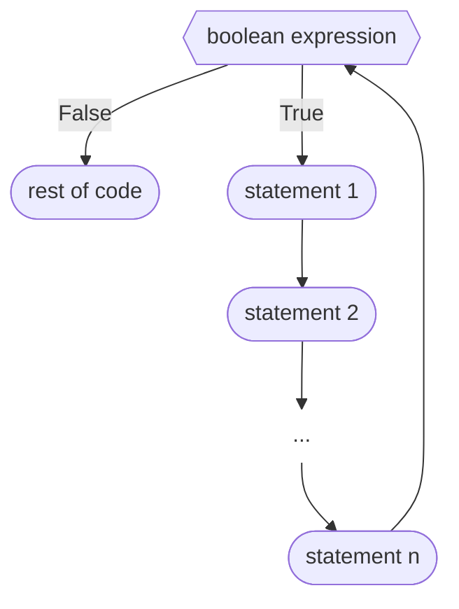

This is a demo solution for an exercise that can be inserted into a page using exercise2.md.
Here is some code:

```processing

int n = (int)random(101); //x can be any integer from 1 to 100


int handshakes = 0;

for(int i = n-1; i > 0; i--){
handshakes = handshakes + i;
}

println(n + " people means");
println(handshakes + " handshakes");

```

And here is a mermaid diagram:

