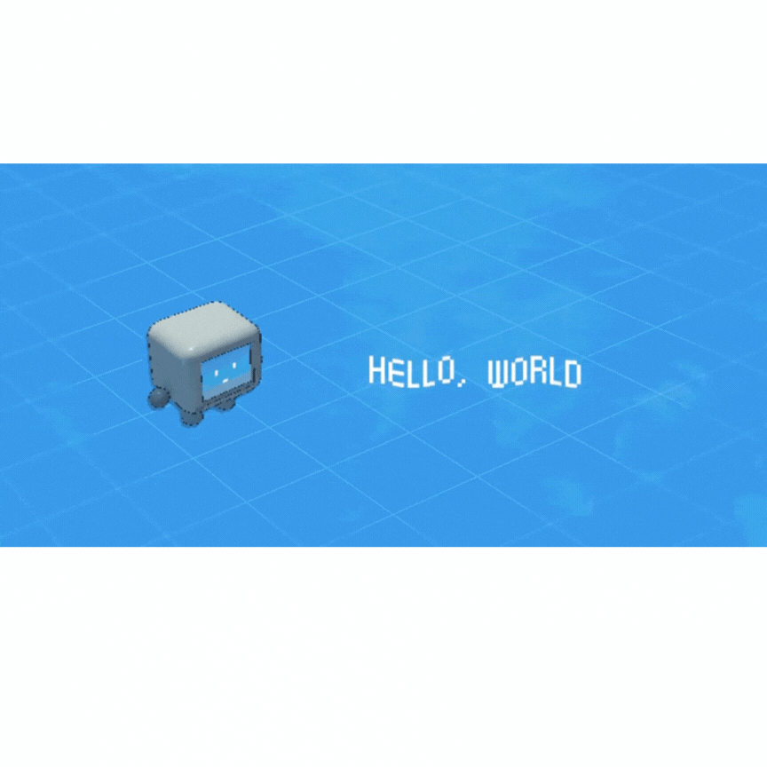

---
# Feel free to add content and custom Front Matter to this file.
# To modify the layout, see https://jekyllrb.com/docs/themes/#overriding-theme-defaults

layout: home
landing_page:
  title: "Welcome"
  nav_order: 0
---

Welcome to the one-stop lecture notes for Software Technology stream, School of Computing, Macquarie University.

If you identify a typo, click on "Edit (README for details)" and hop to the bottom of the Github page for explanation on how to fork, edit, commit and open a pull request.

If you have any suggestions, please email me at [gaurav.gupta@mq.edu.au](mailto:gaurav.gupta@mq.edu.au).