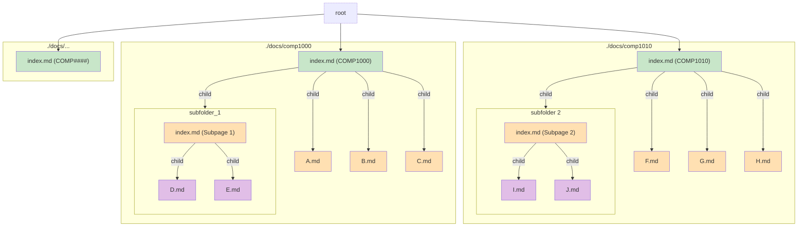

This is a hidden test page.

See the test.md file for implementation.



```mermaid
flowchart TD
 subgraph s1["./docs/comp1000"]
        n1["index.md (COMP1000)"]
        A["A.md"]
        B["B.md"]
        C["C.md"]
        s3["s3"]
  end
 subgraph s4["subfolder 2"]
    direction TB
        n4["index.md (Subpage 2)"]
        I["I.md"]
        J["J.md"]
  end
 subgraph s2["./docs/comp1010"]
        n2["index.md (COMP1010)"]
        F["F.md"]
        G["G.md"]
        H["H.md"]
        s4
  end
 subgraph s3["subfolder_1"]
    direction TB
        n3["index.md (Subpage 1)"]
        D["D.md"]
        E["E.md"]
  end
 subgraph s5["./docs/..."]
        n5["index.md (COMP####)"]
  end
    n0["root"] --> n1 & n2 & n5
    n1 -- child --> A & B & C & s3
    n3 -- child --> D & E
    n2 -- child --> F & G & H & s4
    n4 -- child --> I & J

    style n1 fill:#C8E6C9
    style A fill:#FFE0B2
    style B fill:#FFE0B2
    style C fill:#FFE0B2
    style n4 fill:#FFE0B2
    style I fill:#E1BEE7
    style J fill:#E1BEE7
    style n2 fill:#C8E6C9
    style F fill:#FFE0B2
    style G fill:#FFE0B2
    style H fill:#FFE0B2
    style n3 fill:#FFE0B2
    style D fill:#E1BEE7
    style E fill:#E1BEE7
    style n5 fill:#C8E6C9
    style n0 stroke-width:1px,stroke-dasharray: 1
```

