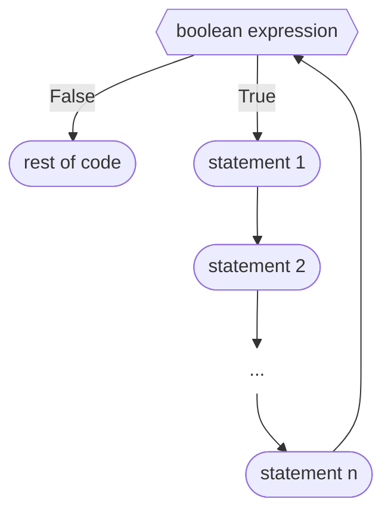

This is a test page.

## Demo for three methods of implementing Exercises/Examples/Scenarios with Solutions

This page demonstrates three methods of implementing exercises/examples/scenarios, essentially the sections with problem staements and a solution hidden away. The aim was to find an implementation that was easier on the developer while leaving the original versions as intact as possible. I used the same example (Scenario 3 from [Loops]({{ site.baseurl }}/comp1000/loops)) so that you could compare the differences between the three of them. Please let me know which version you would like to use from now on.

Note: 
* I added more divs for greater customization and design flexibility.
* As for the design... idk, I like green. I also felt putting it in a coloured block would help distinguish it within the page. Let me know if you want the design to be modified.
* Each prototype includes a Mermaid diagram inside the details element, as I had previously encountered issues with implementing them. 

[Relevant files](https://github.com/CCheung96/software-tech-demo):
* test.md
* _includes/exercise.html
* _includes/exercise2.html
* _includes/exercises/* (Maybe should be moved into the assets folder)
* assets/css/main.css

<!-- Example 1: Everything in page -->
<div class="exercise-container">

<h2>Prototype 1: Contents and HTML all in page</h2>

<div class="exercise-problem" markdown="1">
This version is closest to the original in that all the HTML structure and exercise content are written together in the page.

Pros:
* All the code is in one place
* The code is in an order that is intuitive for all people regardless of their technical expertise

Cons:
* Bloats the page
* It will be hard to style the HTML consistently


For this scenario, you should assume that `n` is generated using the following statement:

```processing
int n = (int)random(101); //n can be any integer from 0 to 100
```

Consider a party where there are 4 people. Call them Alice, Bob, Charles and Diane. Assuming they are all friendly and logical people, the following handshakes will take place:

- Alice with
	1. Bob
	2. Charles
	3. Diane
- Bob (already shook hands with Alice) with
	1. Charles
	2. Diane
- Charles (already shook hands with Alice and Bob) with
	1. Diane
- Diane (already shook hands with everyone)

Thus, there are 3+2+1 = 6 handshakes for 4 people.

If a fifth person (Eddie) joins the party, he shakes hands with all the others.

Thus, there are **`4`**+`3`+`2`+`1` = `10` handshakes for 5 people.

A table summarizing this pattern is given below,

{: .table}
| Number of people 	| Number of handshakes         	|
|------------------	|------------------------------	|
| 1                	| 0                            	|
| 2                	| 1                            	|
| 3                	| 2+1                          	|
| 4                	| 3+2+1                        	|
| 5                	| 4+3+2+1                      	|
| ...              	|                              	|
| n                	| (n-1) + (n-2) + .... + 2 + 1 	|

There is actually a very elegant formula to get this value, but for the purpose of our exercise, we'd like you to compute the number of handshakes in a party of `n` people using a loop.
</div>
<div class="exercise-solution">
<details markdown="1"><summary>Solution</summary>

This is the solution:

```
int n = (int)random(101); //x can be any integer from 1 to 100


int handshakes = 0;

for(int i = n-1; i > 0; i--){
  handshakes = handshakes + i;
}

println(n + " people means");
println(handshakes + " handshakes");
```

And this is a mermaid diagram:


</details>
</div>
</div>

<!-- Example 2: Capturing in-page, HTML external -->


This version uses a HTML structure that is separated into an external template exercise.html. 
Within the page, the contents are defined in two capture blocks: one for the problem statement and one for the solution. These capture blocks and the exercise.html template are then put together using the include Liquid syntax. The title is also defined at this point.

Pros:
* No repetitive HTML, only Markdown
* The HTML template can be easily modified

Cons: 
* Still requires duplication in regards to the use of capture and includes syntax
* Defining the problem statement and solution blocks before defining the title is not as intuitive for non-technical users


For this scenario, you should assume that `n` is generated using the following statement:

```processing
int n = (int)random(101); //n can be any integer from 0 to 100
```

Consider a party where there are 4 people. Call them Alice, Bob, Charles and Diane. Assuming they are all friendly and logical people, the following handshakes will take place:

- Alice with
	1. Bob
	2. Charles
	3. Diane
- Bob (already shook hands with Alice) with
	1. Charles
	2. Diane
- Charles (already shook hands with Alice and Bob) with
	1. Diane
- Diane (already shook hands with everyone)

Thus, there are 3+2+1 = 6 handshakes for 4 people.

If a fifth person (Eddie) joins the party, he shakes hands with all the others.

Thus, there are **`4`**+`3`+`2`+`1` = `10` handshakes for 5 people.

A table summarizing this pattern is given below,

{: .table}
| Number of people 	| Number of handshakes         	|
|------------------	|------------------------------	|
| 1                	| 0                            	|
| 2                	| 1                            	|
| 3                	| 2+1                          	|
| 4                	| 3+2+1                        	|
| 5                	| 4+3+2+1                      	|
| ...              	|                              	|
| n                	| (n-1) + (n-2) + .... + 2 + 1 	|

There is actually a very elegant formula to get this value, but for the purpose of our exercise, we'd like you to compute the number of handshakes in a party of `n` people using a loop.



Here is the solution:

```
int n = (int)random(101); //x can be any integer from 1 to 100

int handshakes = 0;

for(int i = n-1; i > 0; i--){
  handshakes = handshakes + i;
}

println(n + " people means");
println(handshakes + " handshakes");
```

And here is a mermaid diagram:






<!-- Example 3 External HTML and Content (see scenario-3-problem.md for explanation)-->

